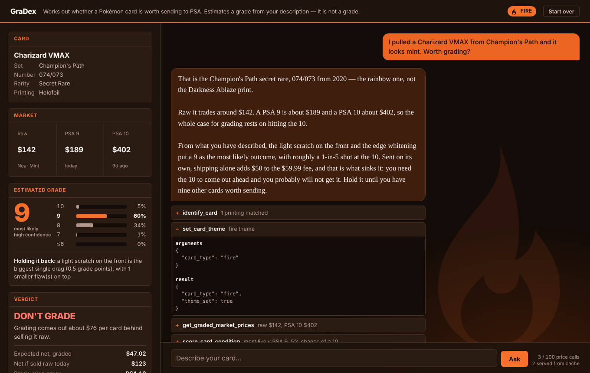

[![Contributors][contributors-shield]][contributors-url]
[![Forks][forks-shield]][forks-url]
[![Stargazers][stars-shield]][stars-url]
[![Issues][issues-shield]][issues-url]
[![MIT License][license-shield]][license-url]
[![LinkedIn][linkedin-shield]][linkedin-url]

# GraDex: Should I grade my Pokemon Card?
Author: Veronica Koval

Try it: **https://gradex-veronicak.cloud.run/** (Use your columbia.edu account)

## Showcase
The interface recolors itself to the card's Pokémon type once the agent identifies it. Fire is shown here.



## Goal
Pokémon cards are a whole trading economy. The same Pokémon is printed in many sets and versions, and the better a card's condition, the more it is worth. Collectors send their best cards to PSA, the main grading company, to get an official condition score from 1 to 10. A high grade, especially a 10, can make a card sell for several times more.

But grading costs money: **$59.99 or more per card, plus roughly $50 shipping** on a small order. If the card comes back a 9 instead of a 10, the grade often adds less value than it cost, so grading can lose money. GraDex answers one question: **is this card worth sending to PSA, or should I sell it as it is?**

## Description
GraDex is a chat agent. You describe a card, and it:
1. Works out exactly which printing you have by asking questions.
2. Looks up what the card sells for ungraded and at each PSA grade.
3. Asks simple questions about its condition (centering, corners, edges, surface) and estimates the odds of each PSA grade.
4. Subtracts the grading fees, shipping and selling fees, and compares the result to selling the card now.
5. Gives a verdict: **GRADE IT**, **MARGINAL**, or **DON'T GRADE**, with the numbers behind it.

It is an estimate from your description, not a real grade. Prices are market prices, not completed sales.

## Built With
[![Python][Python]][Python-url]
[![FastAPI][FastAPI]][FastAPI-url]
[![OpenAI Agents SDK][Agents]][Agents-url]
[![Gemini][Gemini]][Gemini-url]
[![Docker][Docker]][Docker-url]
[![Google Cloud Run][CloudRun]][CloudRun-url]

## How to Use
Open the link above, describe a card, and answer the agent's questions. Click a tool-call chip under any reply to see exactly what the agent called and what it got back. **Start over** begins a new session.

### Three sample queries
1. `I pulled a Charizard VMAX from Champion's Path and it looks mint. Worth grading?` The agent asks for the collector number, prices the card, asks condition questions, and usually says not to grade it on its own.
2. `I have a 1999 Base Set Blastoise, holo, kept in a binder since I was a kid.` An old card kept in a binder: the odds of a top grade are low.
3. `Is it worth grading a Moonbreon? I have the Evolving Skies alt art.` A high-value card where grading usually pays off.

## Tools
| Tool | What it does |
| --- | --- |
| `identify_card` | Narrows your description to one exact printing, asking the most useful question when several match. |
| `get_graded_market_prices` | **External data:** looks up the raw price and each PSA grade's price from the JustTCG API. |
| `set_card_theme` | Tells the interface the card's Pokémon type so it can change theme. |
| `score_card_condition` | Turns your condition answers into the odds of each PSA grade. |
| `grading_verdict` | Compares the expected value of grading, after all costs, against selling raw. |

## Run it locally
```bash
uv run app.py          # http://localhost:8000
```
Set `GEMINI_API_KEY` (free, from [aistudio.google.com](https://aistudio.google.com)) and `JUSTTCG_API_KEY` (free, from [justtcg.com](https://justtcg.com)) first. Run `uv run selftest.py` for offline checks.

## Sources
- [**PSA grading service levels and fees**](https://www.psacard.com/services/tradingcardgrading)
- [**PSA centering standards**](https://www.cardcenteringtool.com/centering-for/psa)
- [**PSA 10 gem rates by era**](https://www.pokeinvest.io/gem-rates)
- [**JustTCG API**](https://justtcg.com/docs)

## Contributors
- Veronica Koval: [**LinkedIn**](https://www.linkedin.com/in/veronicakoval), [**GitHub**](https://github.com/VerKoval/)
